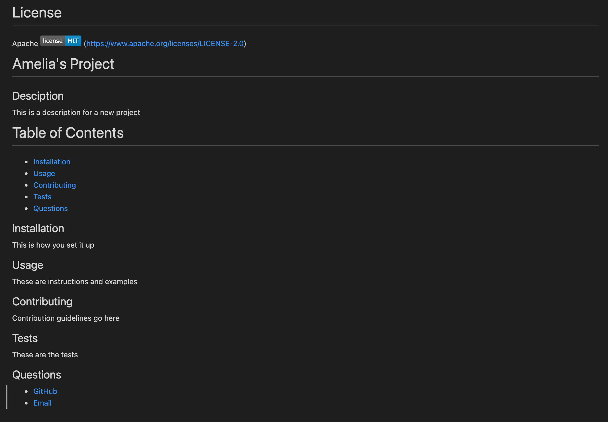

# README Generator

# Description
This assignment required a README file to be generated using node.js.
The command-line application takes in some required input to generate a professional README file for a project.
When the user opens the application in the terminal, a series of prompts display for the user to answer.
The input requirements include a project title, description, table of contents, installation instructions, usage information, contribution guidelines, and test instructions.
The users GitHub and email address are also required and are included under a 'Questions' section.
The selected license is displayed at the top of the page with the license badge and a link to the license website.

Screenshot of example application

Link to github repository: https://github.com/ahooper00/readme-generator